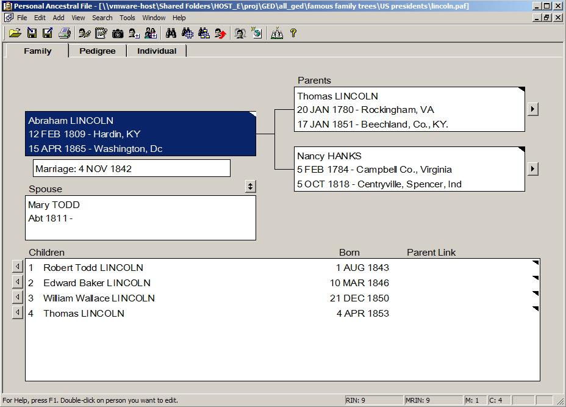
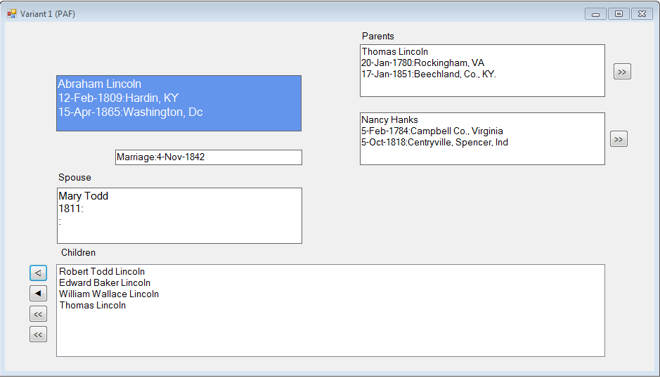

# FamilyView

Part of the YAGP suite of genealogy tools :)

This is a GUI design "sandbox", trying some variations on a "Family View". The primary inspiration is the Family View
screen of PAF (Personal Ancestral File). 

Four variants are currently presented, the first being a reconstruction of the PAF screen.

Also acts as a "demo" / proof-of-concept exercise for the [YAGP parser library](https://github.com/fire-eggs/YAGP).

The PAF screen:

This project's "Variant 1" (as of first commit):

